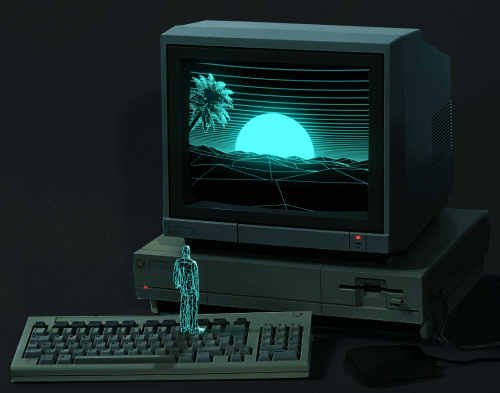

  <!-- Typing-svg (Hello World) -->
  

    
  

  <!-- GIF -->

  

  <!-- for beauty -->
  
&nbsp;

 
  

  &emsp;
  &emsp;
  &emsp;
  &emsp;
  &emsp;
  

   

<i>
I'm a Full Stack Developer and I'm currently learning DevOps, and Game Development. 
Open to collaborating on interesting and innovative projects. 
</i>

 <!-- Snake Code Contribution Map -->
  <picture>
    <source media="(prefers-color-scheme: dark)" srcset="https://raw.githubusercontent.com/Shaclight69/Shaclight69/output/github-contribution-grid-snake-dark.svg" />
    <source media="(prefers-color-scheme: light)" srcset="https://raw.githubusercontent.com/Shaclight69/Shaclight69/output/github-contribution-grid-snake.svg" />
    
  </picture>

#### ㅅ Technologies:

 <!-- Github Stats -->

  
  
  

