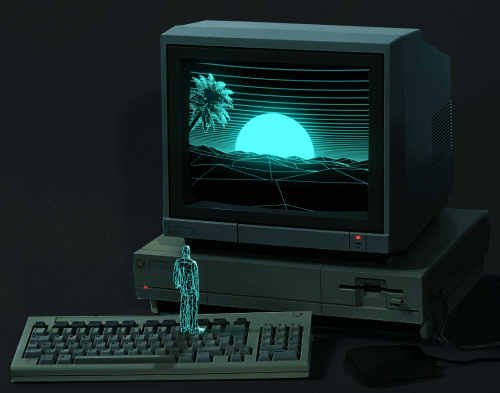

<!-- 

 -->

  

    
  

  

  <!-- for beauty 留个空行好看点 -->
  
&nbsp;

  

&emsp;
&emsp;
&emsp;
<a href="https://discord.com/users/317281861019631616">&emsp;</a>
<a href="mailto:medhiaghorbel@gmail.com">&emsp;</a>

  

  <i>
  I'm a Full Stack Developer and I'm currently learning DevOps, and Game Develompement. 
  Open to collaborating on interesting and innovative projects. 
  </i>
   

<!-- 

 -->

## 💻 Tech Stack:

 

  

## 🌐 Connect with me :

## 📊 GitHub Stats:

 &nbsp; &nbsp;

 

### 🔝 Top Contributed Repo :

